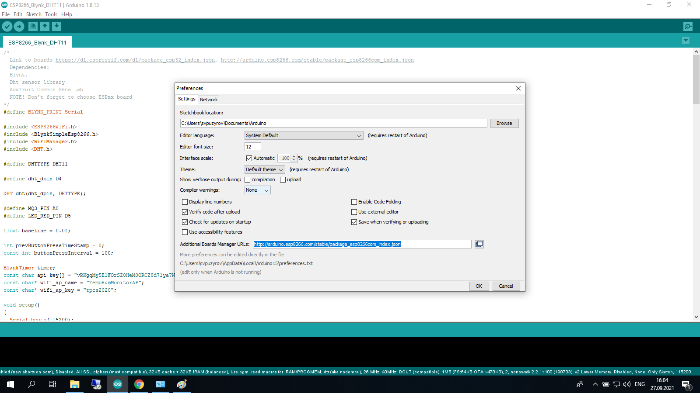
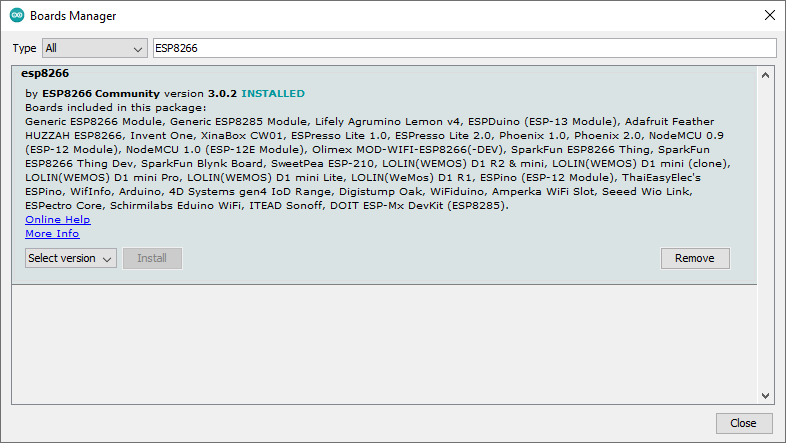
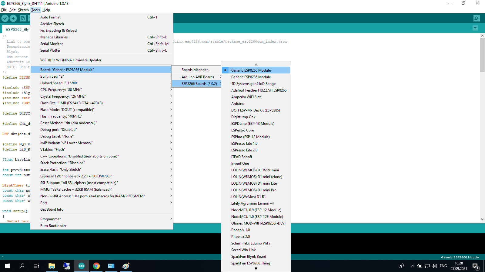
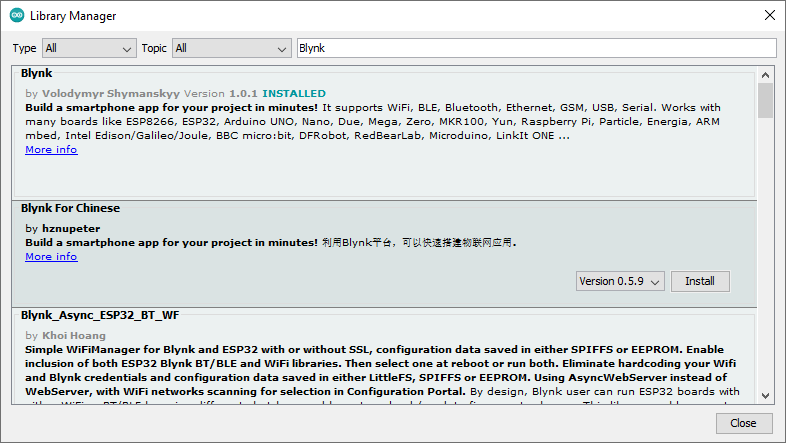
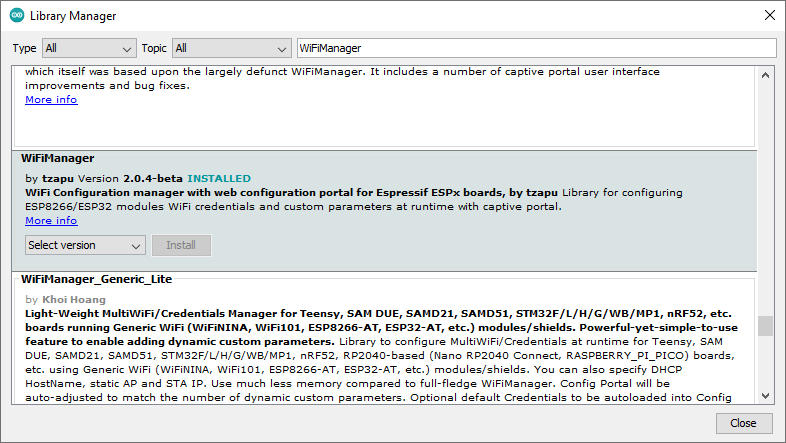

### Sample projects for Arduino based on ESP8266 board

#### Pre-requests Arduino IDE

* Open Arduino IDE and go to `File > Preferences`
* In the option dialog find field `Additional Boards Manager URLs` and type `http://arduino.esp8266.com/stable/package_esp8266com_index.json`

* Next step - open `Tools > Board (...) > Board Manager...` dialog and install ESP8266 support

* After that connect board to your PC and change its type to `Generic ESP8266 Module`

* After that install libraries using `Sketch > Include library > Manage libraries...`
 * `Blynk`
 
 

* WiFiManager

